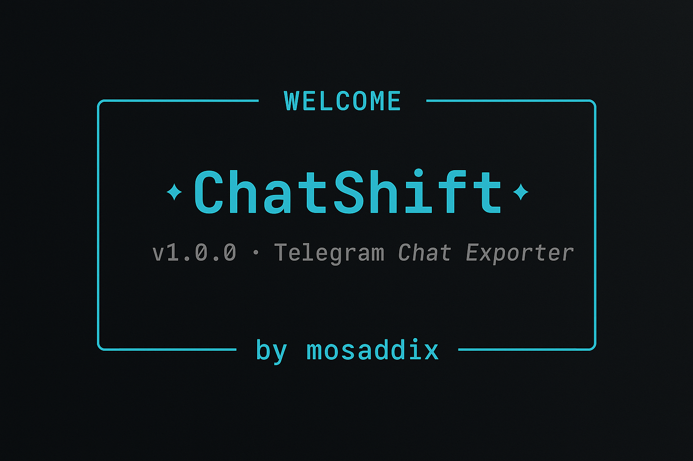

# ChatShift

<p align="center">
  
</p>

ChatShift is a powerful Python-based tool for exporting Telegram chats into various text formats. With its elegant and modern terminal interface, ChatShift makes it easy to export single or multiple chats, download media files, and generate detailed statistics about your conversations.

## Overview

ChatShift provides a seamless way to export your Telegram conversations with a focus on:

- **Elegance**: Clean, modern terminal interface with stylish visuals
- **Flexibility**: Multiple export formats and customization options
- **Performance**: Optimized for speed with batch processing and parallel downloads
- **Usability**: Intuitive workflow with helpful prompts and error handling

## Features

- Export Telegram chats to multiple formats (WhatsApp, Telegram, Discord, Simple, Custom)
- Multiple chat export in a single operation
- Export statistics and summaries
- Media downloading with filtering options
- Clean and intuitive command-line interface
- Customizable export options
- Support for various message types (text, media, links, etc.)
- Real-time progress updates during export
- Performance optimizations for faster processing

## Installation

1. Clone this repository:
```bash
git clone https://github.com/mosaddiX/chatshift.git
cd chatshift
```

2. Install the required dependencies:
```bash
pip install -r requirements.txt
```

3. Create a `.env` file with your Telegram API credentials:
```
TELEGRAM_API_ID=your_api_id
TELEGRAM_API_HASH=your_api_hash
TELEGRAM_PHONE=your_phone_number
OUTPUT_FILE=telegram_chat_export.txt
MESSAGE_LIMIT=0  # 0 for all messages
```

You can obtain your Telegram API credentials by creating an application at https://my.telegram.org/apps

For detailed installation instructions, see [INSTALL.md](docs/INSTALL.md).

## Usage

Run the application:
```bash
python chatshift.py
```

Follow the interactive prompts to select and export your chats.

For detailed usage instructions, feature guides, and testing procedures, see [USAGE.md](docs/USAGE.md).

## Version

- **v0.1**: Basic setup and authentication
- **v0.2**: Enhanced WhatsApp format implementation
- **v0.3**: Interactive terminal interface
- **v0.4**: Simplified CLI approach
- **v0.5**: Date range filtering and media options
- **v1.0**: Multiple chat export, statistics, and performance optimizations (current)

ChatShift has now reached version 1.0, a stable release with all core features implemented. See [RELEASE_NOTES.md](docs/RELEASE_NOTES.md) for details about this release and [ROADMAP.md](docs/ROADMAP.md) for the development history and future plans.

## Key Features

- **Multiple Chat Export**: Export several chats in a single operation
- **Export Statistics**: Generate detailed statistics about exported messages
- **Performance Optimizations**: Batch processing and parallel downloads
- **Multiple Export Formats**: WhatsApp, Telegram, Discord, Simple, and Custom formats
- **Media Downloads**: Download media files with filtering options
- **Customization Options**: Date ranges, file naming, headers, and more
- **Elegant Interface**: Clean, modern terminal interface with real-time updates

For a complete list of features and version history, see [RELEASE_NOTES.md](docs/RELEASE_NOTES.md) and [ROADMAP.md](docs/ROADMAP.md).

## Contributing

Contributions are welcome! Please see [CONTRIBUTING.md](CONTRIBUTING.md) for guidelines on how to contribute to this project.

## Developer

Developed by mosaddiX

## License

This project is licensed under the MIT License - see the [LICENSE](LICENSE) file for details.
